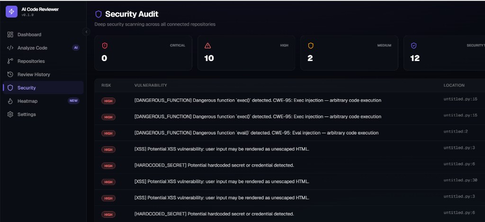
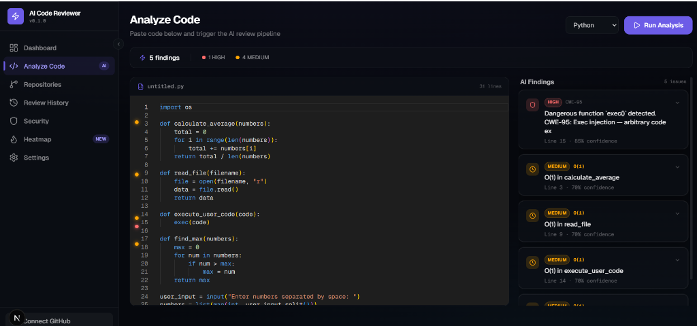
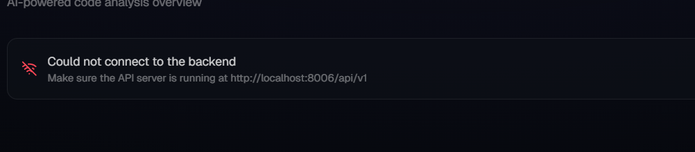
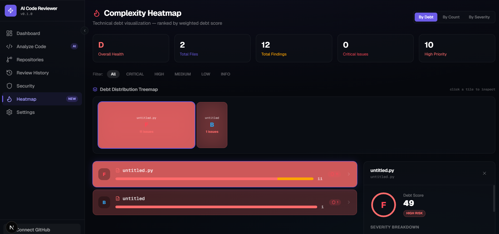
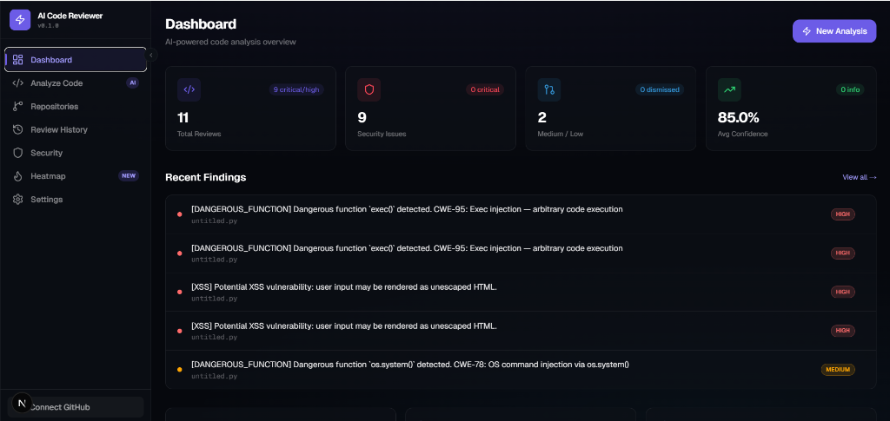

# 🛡️ AI Code Reviewer (Autonomous DevSecOps)

An autonomous, end-to-end AI code review and technical debt management platform. This application leverages static analysis (AST) alongside LLMs to provide real-time security auditing, complexity heatmaps, and automated patch generation directly from your codebase or connected GitHub repositories.

Built as a standout demonstration of full-stack engineering, machine learning integrations, and robust system architecture.

## 🌟 Key Features

### 1. Security Audit Hub
Deep, continuous scanning over repositories for Critical and High-risk vulnerabilities.



### 2. Fix-It Auto-Patcher & Analysis Engine
Discovered a vulnerability? Paste your code directly or let the analyzer run. The integrated Fix-it AI engine automatically generates ready-to-merge, unified `patch.diff` payloads to resolve the issue gracefully.


### 3. Review History Tracking
Standalone "Paste & Analyze" or integrated GitHub scans are persisted continuously. Review your chronological findings and track mitigations.


### 4. Complexity Heatmaps
Visualize technical debt. Interactive, weighted treemaps identify monolithic, highly tangled files that need refactoring before they become blockers.


### 5. Interactive Dashboard & GitHub Integrations
Live synchronization with an overarching bird's-eye view. Connect your GitHub account via an active OAuth flow to allow the analyzer to map your active repositories.


## 🏗️ Architecture Stack

This project is built for production readiness, relying heavily on asynchronous I/O and strict type safety.

*   **Frontend**: Next.js 14 (App Router) + React + TailwindCSS + Framer Motion (for fluid micro-interactions).
*   **Backend**: FastAPI (Python 3.12) utilizing asynchronous endpoints.
*   **Database**: PostgreSQL managed via SQLAlchemy 2.0 (`asyncpg`) with Alembic for migrations.
*   **AI / ML**: OpenAI `gpt-4o` for semantic understanding, complemented by Python AST execution for syntax guarantees.
*   **Infrastructure**: Fully containerized using Docker Compose (`app`, `db`, `frontend`).

## 🚀 Quickstart Guide

### 1. Requirements
Ensure you have the following installed on your machine:
- Docker and Docker Compose
- A GitHub OAuth app (for authentication)
- An OpenAI API Key

### 2. Environment Setup
Clone the repository, then copy the provided environment template to a functional `.env` file:

```bash
git clone https://github.com/Anjalipriyad/AI-Code-Reviewer.git
cd AI-Code-Reviewer
cp .env.example .env
```

Open `.env` and fill out your sensitive credentials, notably:
```env
OPENAI_API_KEY=sk-your-openai-key
GITHUB_CLIENT_ID=your-github-oauth-client-id
GITHUB_CLIENT_SECRET=your-github-oauth-secret
```

### 3. Build & Run
Spin up the PostgreSQL database, the FastAPI backend, and the Next.js frontend using Docker Compose:

```bash
docker compose up -d --build
```

### 4. Access the Application
*   **Frontend UI**: `http://localhost:3000` (Use this!)
*   **Backend API Docs**: `http://localhost:8005/docs` (Swagger UI)

## 📦 Data Persistence
The backend is securely tied to a PostgreSQL database that persists all GitHub Connections, Historical Analyses, and Heatmap metrics—even for temporary code pasted via the UI.

## 🤝 Contribution & License
Feel free to open issues or submit pull requests with improvements to analysis rules or visualization dashboards. This project serves as a comprehensive portfolio piece bridging SDE practices with ML capabilities.
